# Stratum Architecture Documentation

This document provides comprehensive UML diagrams describing the architecture of Stratum, an application for converting OpenStreetMap data into optimized, textured 3D maps.

---

## Table of Contents

1. [High-Level System Architecture](#high-level-system-architecture)
2. [Core Module](#core-module)
3. [Renderer Module](#renderer-module)
4. [Scene Module](#scene-module)
5. [OSM Module](#osm-module)
6. [Materials Module](#materials-module)
7. [Editor Module](#editor-module)
8. [Data Flow Diagrams](#data-flow-diagrams)
9. [Sequence Diagrams](#sequence-diagrams)
10. [State Diagrams](#state-diagrams)

---

## High-Level System Architecture

### Package Diagram

This diagram shows the high-level organization of Stratum into modules and their dependencies.

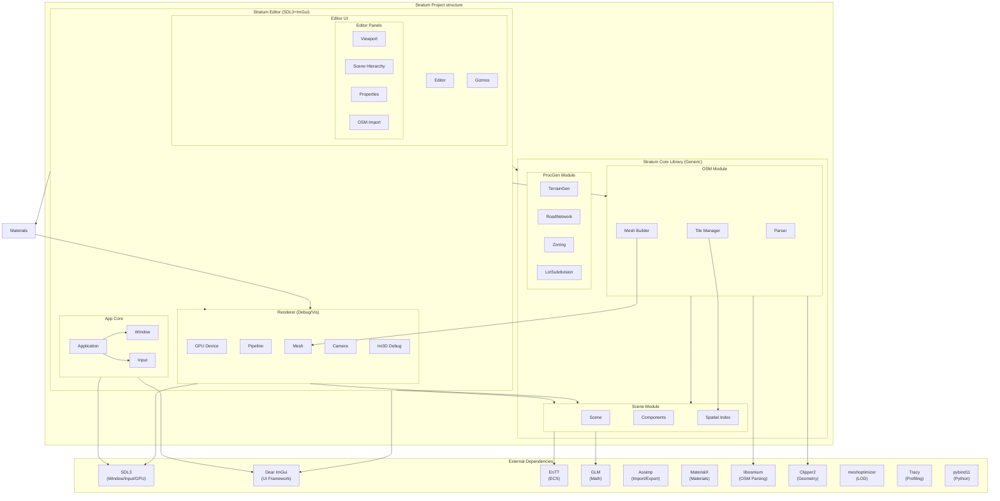
```mermaid
graph TB
    subgraph External["External Dependencies"]
        SDL3["SDL3<br/>(Window/Input/GPU)"]
        ImGui["Dear ImGui<br/>(UI Framework)"]
        EnTT["EnTT<br/>(ECS)"]
        GLM["GLM<br/>(Math)"]
        Assimp["Assimp<br/>(Import/Export)"]
        MaterialX["MaterialX<br/>(Materials)"]
        Osmium["libosmium<br/>(OSM Parsing)"]
        Clipper2["Clipper2<br/>(Geometry)"]
        Meshopt["meshoptimizer<br/>(LOD)"]
        Tracy["Tracy<br/>(Profiling)"]
        pybind11["pybind11<br/>(Python)"]
    end

    subgraph Stratum["Stratum Project structure"]
        subgraph CoreLib["Stratum Core Library (Generic)"]
            subgraph Scene["Scene Module"]
                SceneGraph["Scene"]
                Components
                Spatial["Spatial Index"]
            end

            subgraph OSM["OSM Module"]
                Parser
                MeshBuilder["Mesh Builder"]
                TileManager["Tile Manager"]
            end
            
            subgraph ProcGen["ProcGen Module"]
                TerrainGen
                RoadNetwork
                Zoning
                LotSubdivision
            end
        end

        subgraph Editor["Stratum Editor (SDL3+ImGui)"]
            subgraph Core["App Core"]
                Application
                Window
                Input
            end

            subgraph Renderer["Renderer (Debug/Vis)"]
                GPUDevice["GPU Device"]
                Pipeline
                Mesh
                Camera
                Im3D_Integration["Im3D Debug"]
            end

            subgraph EditorUI["Editor UI"]
                EditorMain["Editor"]
                Gizmos
                subgraph Panels["Editor Panels"]
                    ViewportPanel["Viewport"]
                    ScenePanel["Scene Hierarchy"]
                    PropertiesPanel["Properties"]
                    OSMPanel["OSM Import"]
                end
            end
        end
    end

    %% External Dependencies
    Core --> SDL3
    Core --> ImGui
    Renderer --> SDL3
    Scene --> EnTT
    Scene --> GLM
    OSM --> Osmium
    OSM --> Clipper2
    Editor --> ImGui
    Editor --> CoreLib

    %% Internal Dependencies
    Application --> Window
    Application --> Input
    Editor --> Scene
    Editor --> Renderer
    Editor --> OSM
    Editor --> Materials
    Renderer --> Scene
    OSM --> Scene
    Materials --> Renderer
    MeshBuilder --> Mesh
    TileManager --> Spatial
```

### Component Diagram

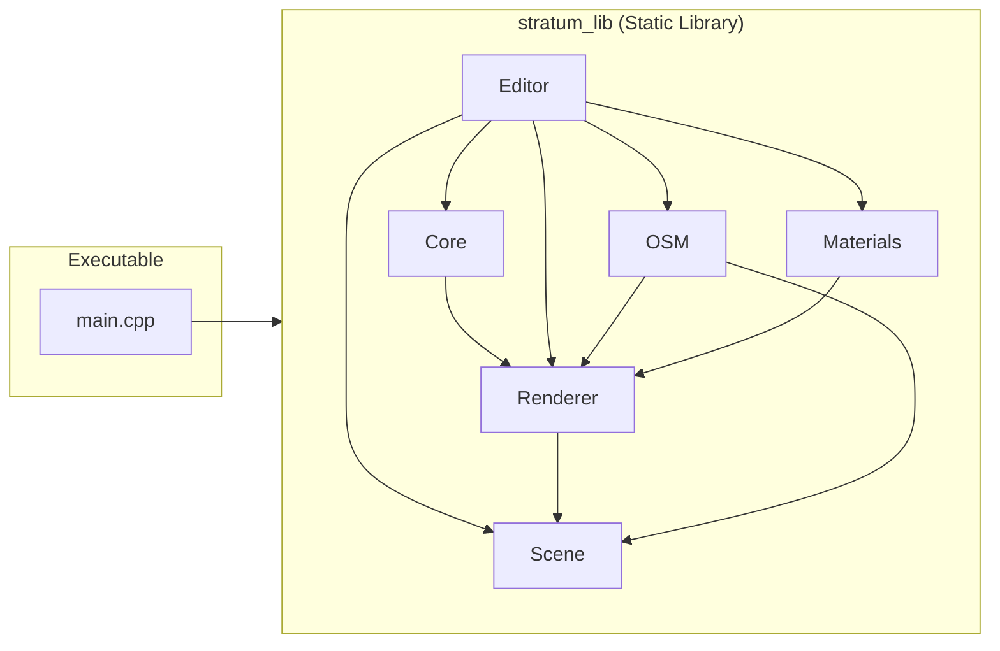
```mermaid
graph LR
    subgraph Executable
        main["main.cpp"]
    end

    subgraph stratum_lib["stratum_lib (Static Library)"]
        CoreLib["Core"]
        RendererLib["Renderer"]
        SceneLib["Scene"]
        OSMLib["OSM"]
        MaterialsLib["Materials"]
        EditorLib["Editor"]
    end

    main --> stratum_lib
    
    CoreLib --> RendererLib
    EditorLib --> CoreLib
    EditorLib --> RendererLib
    EditorLib --> SceneLib
    EditorLib --> OSMLib
    EditorLib --> MaterialsLib
    RendererLib --> SceneLib
    OSMLib --> SceneLib
    OSMLib --> RendererLib
    MaterialsLib --> RendererLib
```

---

## Core Module

### Class Diagram

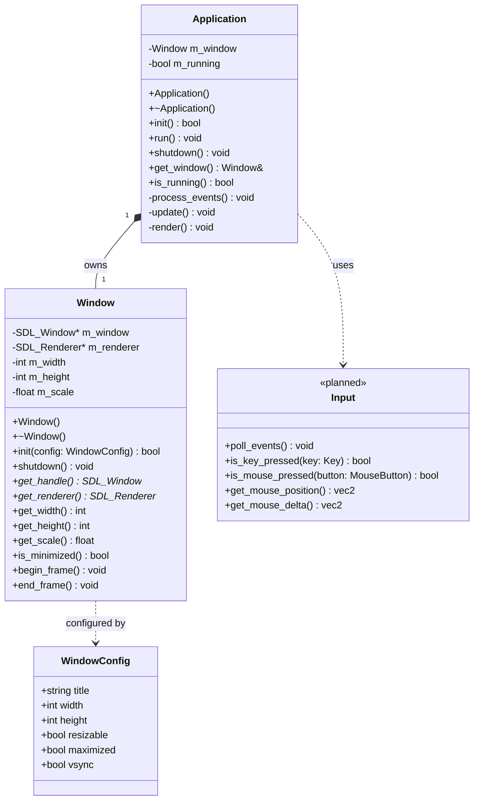
```mermaid
classDiagram
    class Application {
        -Window m_window
        -bool m_running
        +Application()
        +~Application()
        +init() bool
        +run() void
        +shutdown() void
        +get_window() Window&
        +is_running() bool
        -process_events() void
        -update() void
        -render() void
    }

    class WindowConfig {
        +string title
        +int width
        +int height
        +bool resizable
        +bool maximized
        +bool vsync
    }

    class Window {
        -SDL_Window* m_window
        -SDL_Renderer* m_renderer
        -int m_width
        -int m_height
        -float m_scale
        +Window()
        +~Window()
        +init(config: WindowConfig) bool
        +shutdown() void
        +get_handle() SDL_Window*
        +get_renderer() SDL_Renderer*
        +get_width() int
        +get_height() int
        +get_scale() float
        +is_minimized() bool
        +begin_frame() void
        +end_frame() void
    }

    class Input {
        <<planned>>
        +poll_events() void
        +is_key_pressed(key: Key) bool
        +is_mouse_pressed(button: MouseButton) bool
        +get_mouse_position() vec2
        +get_mouse_delta() vec2
    }

    Application "1" *-- "1" Window : owns
    Window ..> WindowConfig : configured by
    Application ..> Input : uses
```

### Detailed Window Class

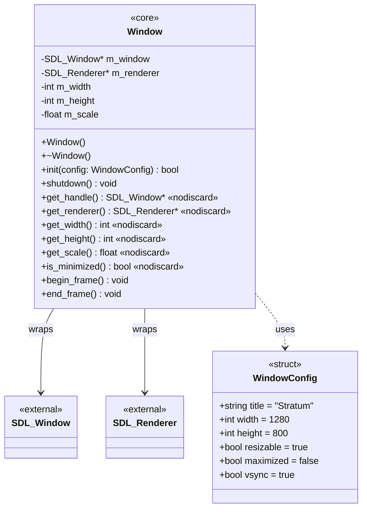
```mermaid
classDiagram
    class Window {
        <<core>>
        -SDL_Window* m_window
        -SDL_Renderer* m_renderer
        -int m_width
        -int m_height
        -float m_scale
        
        +Window()
        +~Window()
        
        +init(config: WindowConfig) bool
        +shutdown() void
        
        +get_handle() SDL_Window* «nodiscard»
        +get_renderer() SDL_Renderer* «nodiscard»
        +get_width() int «nodiscard»
        +get_height() int «nodiscard»
        +get_scale() float «nodiscard»
        +is_minimized() bool «nodiscard»
        
        +begin_frame() void
        +end_frame() void
    }

    class WindowConfig {
        <<struct>>
        +string title = "Stratum"
        +int width = 1280
        +int height = 800
        +bool resizable = true
        +bool maximized = false
        +bool vsync = true
    }

    class SDL_Window {
        <<external>>
    }

    class SDL_Renderer {
        <<external>>
    }

    Window --> SDL_Window : wraps
    Window --> SDL_Renderer : wraps
    Window ..> WindowConfig : uses
```

---

## Renderer Module

### Class Diagram

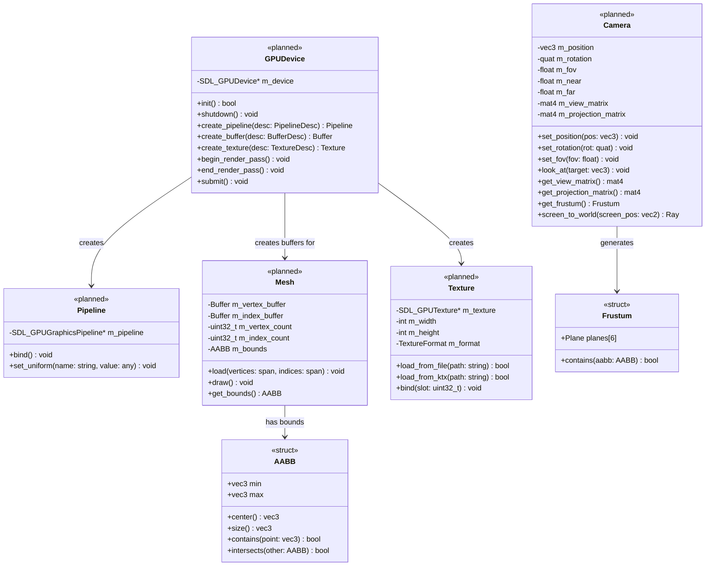
```mermaid
classDiagram
    class GPUDevice {
        <<planned>>
        -SDL_GPUDevice* m_device
        +init() bool
        +shutdown() void
        +create_pipeline(desc: PipelineDesc) Pipeline
        +create_buffer(desc: BufferDesc) Buffer
        +create_texture(desc: TextureDesc) Texture
        +begin_render_pass() void
        +end_render_pass() void
        +submit() void
    }

    class Pipeline {
        <<planned>>
        -SDL_GPUGraphicsPipeline* m_pipeline
        +bind() void
        +set_uniform(name: string, value: any) void
    }

    class Mesh {
        <<planned>>
        -Buffer m_vertex_buffer
        -Buffer m_index_buffer
        -uint32_t m_vertex_count
        -uint32_t m_index_count
        -AABB m_bounds
        +load(vertices: span, indices: span) void
        +draw() void
        +get_bounds() AABB
    }

    class Texture {
        <<planned>>
        -SDL_GPUTexture* m_texture
        -int m_width
        -int m_height
        -TextureFormat m_format
        +load_from_file(path: string) bool
        +load_from_ktx(path: string) bool
        +bind(slot: uint32_t) void
    }

    class Camera {
        <<planned>>
        -vec3 m_position
        -quat m_rotation
        -float m_fov
        -float m_near
        -float m_far
        -mat4 m_view_matrix
        -mat4 m_projection_matrix
        +set_position(pos: vec3) void
        +set_rotation(rot: quat) void
        +set_fov(fov: float) void
        +look_at(target: vec3) void
        +get_view_matrix() mat4
        +get_projection_matrix() mat4
        +get_frustum() Frustum
        +screen_to_world(screen_pos: vec2) Ray
    }

    class AABB {
        <<struct>>
        +vec3 min
        +vec3 max
        +center() vec3
        +size() vec3
        +contains(point: vec3) bool
        +intersects(other: AABB) bool
    }

    class Frustum {
        <<struct>>
        +Plane planes[6]
        +contains(aabb: AABB) bool
    }

    GPUDevice --> Pipeline : creates
    GPUDevice --> Mesh : creates buffers for
    GPUDevice --> Texture : creates
    Mesh --> AABB : has bounds
    Camera --> Frustum : generates
```

### Rendering Pipeline Flow

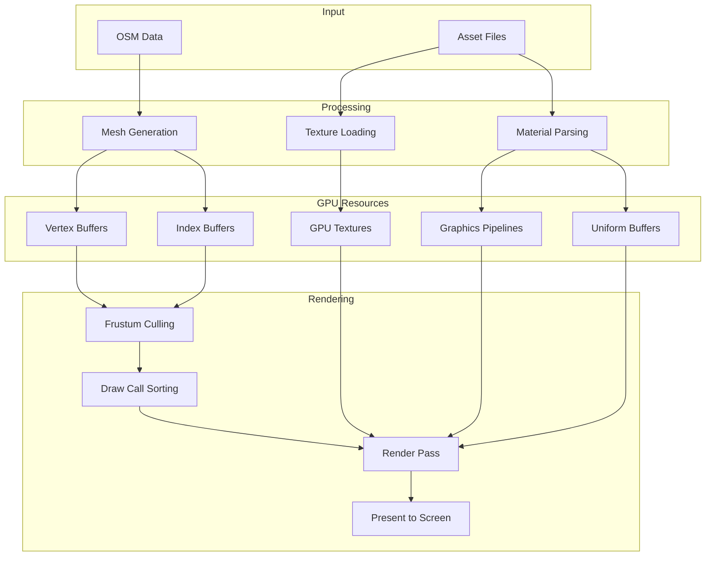
```mermaid
graph TB
    subgraph Input
        OSMData["OSM Data"]
        Assets["Asset Files"]
    end

    subgraph Processing
        MeshGen["Mesh Generation"]
        TexLoad["Texture Loading"]
        MatParse["Material Parsing"]
    end

    subgraph GPUResources["GPU Resources"]
        VBO["Vertex Buffers"]
        IBO["Index Buffers"]
        UBO["Uniform Buffers"]
        TexGPU["GPU Textures"]
        Pipelines["Graphics Pipelines"]
    end

    subgraph Rendering
        CullPass["Frustum Culling"]
        SortPass["Draw Call Sorting"]
        RenderPass["Render Pass"]
        Present["Present to Screen"]
    end

    OSMData --> MeshGen
    Assets --> TexLoad
    Assets --> MatParse
    
    MeshGen --> VBO
    MeshGen --> IBO
    TexLoad --> TexGPU
    MatParse --> Pipelines
    MatParse --> UBO
    
    VBO --> CullPass
    IBO --> CullPass
    CullPass --> SortPass
    SortPass --> RenderPass
    UBO --> RenderPass
    TexGPU --> RenderPass
    Pipelines --> RenderPass
    RenderPass --> Present
```

---

## Scene Module

### Entity Component System Architecture

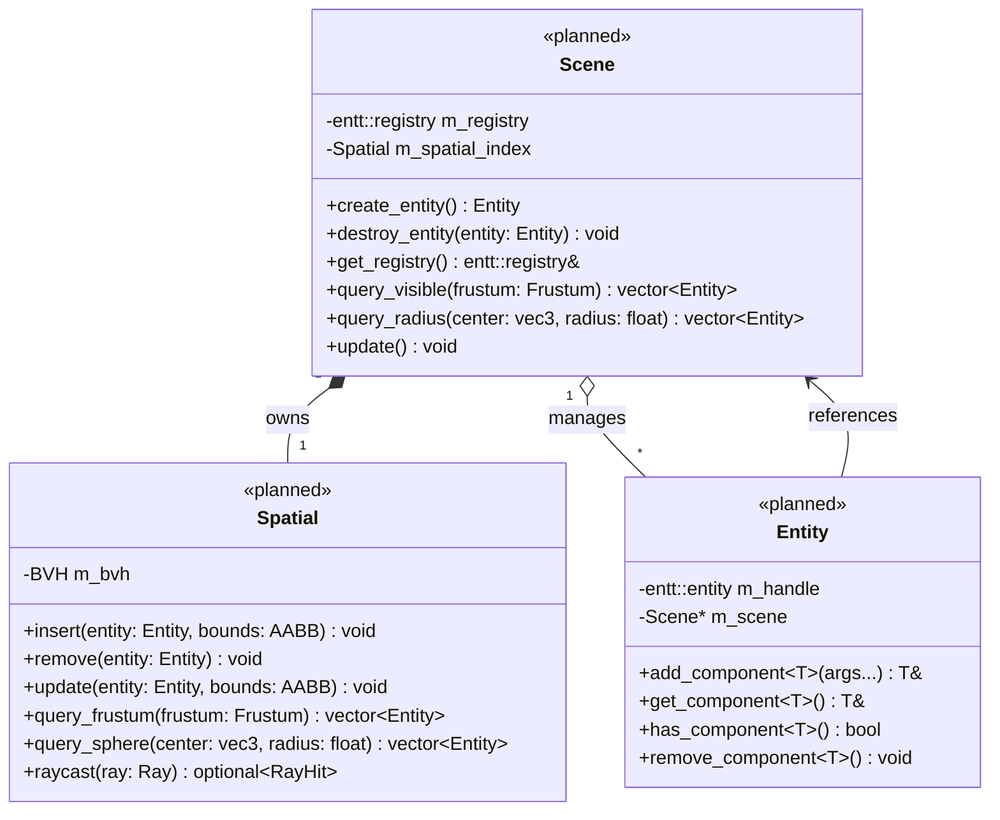
```mermaid
classDiagram
    class Scene {
        <<planned>>
        -entt::registry m_registry
        -Spatial m_spatial_index
        +create_entity() Entity
        +destroy_entity(entity: Entity) void
        +get_registry() entt::registry&
        +query_visible(frustum: Frustum) vector~Entity~
        +query_radius(center: vec3, radius: float) vector~Entity~
        +update() void
    }

    class Entity {
        <<planned>>
        -entt::entity m_handle
        -Scene* m_scene
        +add_component~T~(args...) T&
        +get_component~T~() T&
        +has_component~T~() bool
        +remove_component~T~() void
    }

    class Spatial {
        <<planned>>
        -BVH m_bvh
        +insert(entity: Entity, bounds: AABB) void
        +remove(entity: Entity) void
        +update(entity: Entity, bounds: AABB) void
        +query_frustum(frustum: Frustum) vector~Entity~
        +query_sphere(center: vec3, radius: float) vector~Entity~
        +raycast(ray: Ray) optional~RayHit~
    }

    Scene "1" *-- "1" Spatial : owns
    Scene "1" o-- "*" Entity : manages
    Entity --> Scene : references
```

### Component Types

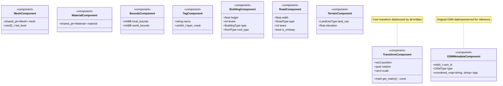
```mermaid
classDiagram
    class TransformComponent {
        <<component>>
        +vec3 position
        +quat rotation
        +vec3 scale
        +mat4 get_matrix() const
    }

    class MeshComponent {
        <<component>>
        +shared_ptr~Mesh~ mesh
        +uint32_t lod_level
    }

    class MaterialComponent {
        <<component>>
        +shared_ptr~Material~ material
    }

    class BoundsComponent {
        <<component>>
        +AABB local_bounds
        +AABB world_bounds
    }

    class TagComponent {
        <<component>>
        +string name
        +uint64_t layer_mask
    }

    class OSMMetadataComponent {
        <<component>>
        +int64_t osm_id
        +OSMType type
        +unordered_map~string, string~ tags
    }

    class BuildingComponent {
        <<component>>
        +float height
        +int levels
        +BuildingType type
        +RoofType roof_type
    }

    class RoadComponent {
        <<component>>
        +float width
        +RoadType type
        +int lanes
        +bool is_oneway
    }

    class TerrainComponent {
        <<component>>
        +LandUseType land_use
        +float elevation
    }

    note for TransformComponent "Core transform data\nused by all entities"
    note for OSMMetadataComponent "Original OSM data\npreserved for reference"
```

### Scene Graph Relationships

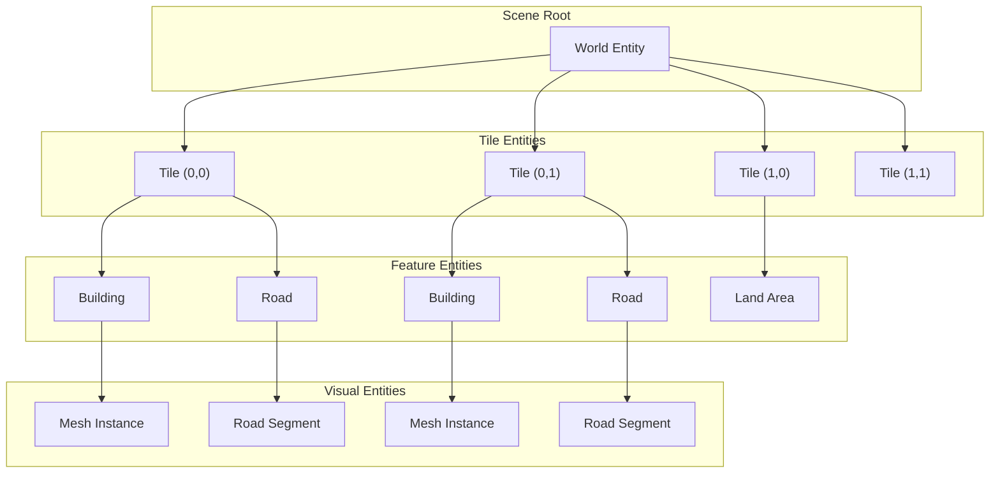
```mermaid
graph TB
    subgraph SceneRoot["Scene Root"]
        World["World Entity"]
    end

    subgraph Tiles["Tile Entities"]
        Tile1["Tile (0,0)"]
        Tile2["Tile (0,1)"]
        Tile3["Tile (1,0)"]
        Tile4["Tile (1,1)"]
    end

    subgraph Features["Feature Entities"]
        Building1["Building"]
        Building2["Building"]
        Road1["Road"]
        Road2["Road"]
        Area1["Land Area"]
    end

    subgraph Visuals["Visual Entities"]
        Mesh1["Mesh Instance"]
        Mesh2["Mesh Instance"]
        Mesh3["Road Segment"]
        Mesh4["Road Segment"]
    end

    World --> Tile1
    World --> Tile2
    World --> Tile3
    World --> Tile4

    Tile1 --> Building1
    Tile1 --> Road1
    Tile2 --> Building2
    Tile2 --> Road2
    Tile3 --> Area1

    Building1 --> Mesh1
    Building2 --> Mesh2
    Road1 --> Mesh3
    Road2 --> Mesh4
```

---

## OSM Module

### Class Diagram

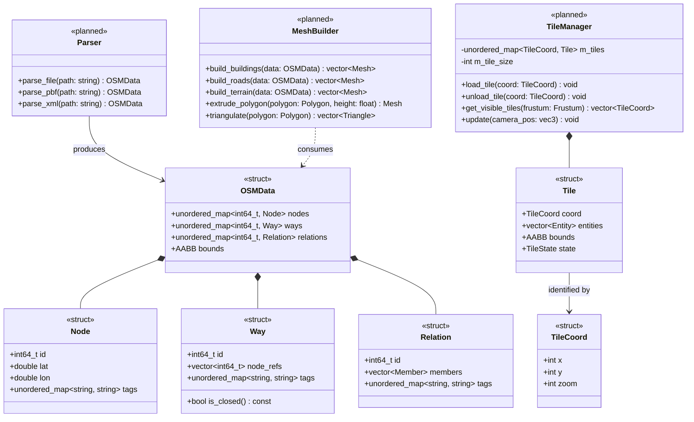
```mermaid
classDiagram
    class Parser {
        <<planned>>
        +parse_file(path: string) OSMData
        +parse_pbf(path: string) OSMData
        +parse_xml(path: string) OSMData
    }

    class OSMData {
        <<struct>>
        +unordered_map~int64_t, Node~ nodes
        +unordered_map~int64_t, Way~ ways
        +unordered_map~int64_t, Relation~ relations
        +AABB bounds
    }

    class Node {
        <<struct>>
        +int64_t id
        +double lat
        +double lon
        +unordered_map~string, string~ tags
    }

    class Way {
        <<struct>>
        +int64_t id
        +vector~int64_t~ node_refs
        +unordered_map~string, string~ tags
        +bool is_closed() const
    }

    class Relation {
        <<struct>>
        +int64_t id
        +vector~Member~ members
        +unordered_map~string, string~ tags
    }

    class MeshBuilder {
        <<planned>>
        +build_buildings(data: OSMData) vector~Mesh~
        +build_roads(data: OSMData) vector~Mesh~
        +build_terrain(data: OSMData) vector~Mesh~
        +extrude_polygon(polygon: Polygon, height: float) Mesh
        +triangulate(polygon: Polygon) vector~Triangle~
    }

    class TileManager {
        <<planned>>
        -unordered_map~TileCoord, Tile~ m_tiles
        -int m_tile_size
        +load_tile(coord: TileCoord) void
        +unload_tile(coord: TileCoord) void
        +get_visible_tiles(frustum: Frustum) vector~TileCoord~
        +update(camera_pos: vec3) void
    }

    class TileCoord {
        <<struct>>
        +int x
        +int y
        +int zoom
    }

    class Tile {
        <<struct>>
        +TileCoord coord
        +vector~Entity~ entities
        +AABB bounds
        +TileState state
    }

    Parser --> OSMData : produces
    OSMData *-- Node
    OSMData *-- Way
    OSMData *-- Relation
    MeshBuilder ..> OSMData : consumes
    TileManager *-- Tile
    Tile --> TileCoord : identified by
```

### OSM Processing Pipeline

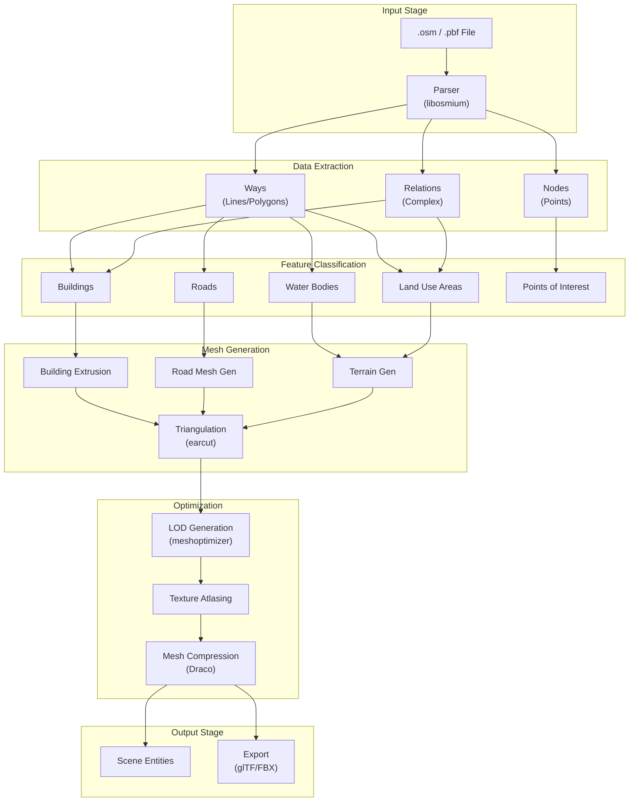
```mermaid
flowchart TB
    subgraph Input["Input Stage"]
        OSMFile[".osm / .pbf File"]
        Parser["Parser<br/>(libosmium)"]
    end

    subgraph Extraction["Data Extraction"]
        Nodes["Nodes<br/>(Points)"]
        Ways["Ways<br/>(Lines/Polygons)"]
        Relations["Relations<br/>(Complex)"]
    end

    subgraph Classification["Feature Classification"]
        Buildings["Buildings"]
        Roads["Roads"]
        Water["Water Bodies"]
        LandUse["Land Use Areas"]
        POIs["Points of Interest"]
    end

    subgraph MeshGeneration["Mesh Generation"]
        Extrusion["Building Extrusion"]
        RoadGen["Road Mesh Gen"]
        TerrainGen["Terrain Gen"]
        Triangulation["Triangulation<br/>(earcut)"]
    end

    subgraph Optimization["Optimization"]
        LODGen["LOD Generation<br/>(meshoptimizer)"]
        Atlasing["Texture Atlasing"]
        Compression["Mesh Compression<br/>(Draco)"]
    end

    subgraph Output["Output Stage"]
        SceneEntities["Scene Entities"]
        Export["Export<br/>(glTF/FBX)"]
    end

    OSMFile --> Parser
    Parser --> Nodes
    Parser --> Ways
    Parser --> Relations

    Nodes --> POIs
    Ways --> Buildings
    Ways --> Roads
    Ways --> Water
    Ways --> LandUse
    Relations --> Buildings
    Relations --> LandUse

    Buildings --> Extrusion
    Roads --> RoadGen
    Water --> TerrainGen
    LandUse --> TerrainGen

    Extrusion --> Triangulation
    RoadGen --> Triangulation
    TerrainGen --> Triangulation

    Triangulation --> LODGen
    LODGen --> Atlasing
    Atlasing --> Compression

    Compression --> SceneEntities
    Compression --> Export
```

---

## Materials Module

### Class Diagram

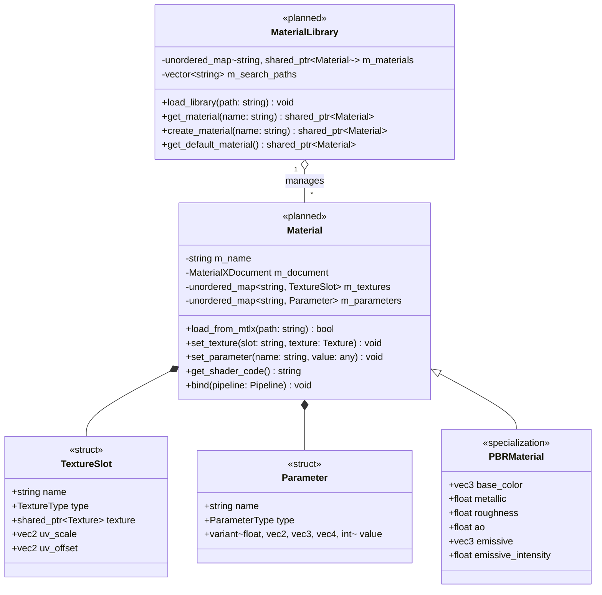
```mermaid
classDiagram
    class Material {
        <<planned>>
        -string m_name
        -MaterialXDocument m_document
        -unordered_map~string, TextureSlot~ m_textures
        -unordered_map~string, Parameter~ m_parameters
        +load_from_mtlx(path: string) bool
        +set_texture(slot: string, texture: Texture) void
        +set_parameter(name: string, value: any) void
        +get_shader_code() string
        +bind(pipeline: Pipeline) void
    }

    class MaterialLibrary {
        <<planned>>
        -unordered_map~string, shared_ptr~Material~~ m_materials
        -vector~string~ m_search_paths
        +load_library(path: string) void
        +get_material(name: string) shared_ptr~Material~
        +create_material(name: string) shared_ptr~Material~
        +get_default_material() shared_ptr~Material~
    }

    class TextureSlot {
        <<struct>>
        +string name
        +TextureType type
        +shared_ptr~Texture~ texture
        +vec2 uv_scale
        +vec2 uv_offset
    }

    class Parameter {
        <<struct>>
        +string name
        +ParameterType type
        +variant~float, vec2, vec3, vec4, int~ value
    }

    class PBRMaterial {
        <<specialization>>
        +vec3 base_color
        +float metallic
        +float roughness
        +float ao
        +vec3 emissive
        +float emissive_intensity
    }

    MaterialLibrary "1" o-- "*" Material : manages
    Material *-- TextureSlot
    Material *-- Parameter
    Material <|-- PBRMaterial
```

### Material Pipeline

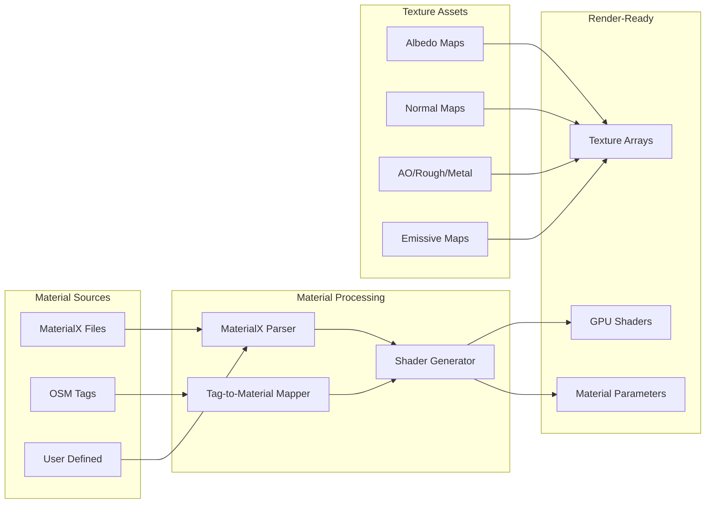
```mermaid
flowchart LR
    subgraph Sources["Material Sources"]
        MTLX["MaterialX Files"]
        OSMTags["OSM Tags"]
        UserDef["User Defined"]
    end

    subgraph Processing["Material Processing"]
        Parser["MaterialX Parser"]
        Mapper["Tag-to-Material Mapper"]
        Generator["Shader Generator"]
    end

    subgraph Assets["Texture Assets"]
        Albedo["Albedo Maps"]
        Normal["Normal Maps"]
        ARM["AO/Rough/Metal"]
        Emissive["Emissive Maps"]
    end

    subgraph Output["Render-Ready"]
        Shaders["GPU Shaders"]
        TexArrays["Texture Arrays"]
        MatParams["Material Parameters"]
    end

    MTLX --> Parser
    OSMTags --> Mapper
    UserDef --> Parser
    
    Parser --> Generator
    Mapper --> Generator
    
    Albedo --> TexArrays
    Normal --> TexArrays
    ARM --> TexArrays
    Emissive --> TexArrays
    
    Generator --> Shaders
    Generator --> MatParams
```

---

## Editor Module

### Class Diagram

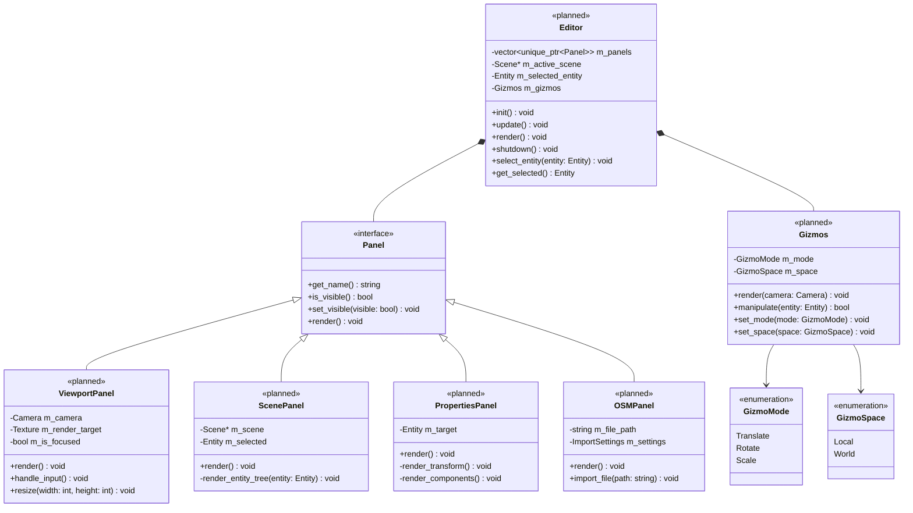
```mermaid
classDiagram
    class Editor {
        <<planned>>
        -vector~unique_ptr~Panel~~ m_panels
        -Scene* m_active_scene
        -Entity m_selected_entity
        -Gizmos m_gizmos
        +init() void
        +update() void
        +render() void
        +shutdown() void
        +select_entity(entity: Entity) void
        +get_selected() Entity
    }

    class Panel {
        <<interface>>
        +get_name() string
        +is_visible() bool
        +set_visible(visible: bool) void
        +render() void
    }

    class ViewportPanel {
        <<planned>>
        -Camera m_camera
        -Texture m_render_target
        -bool m_is_focused
        +render() void
        +handle_input() void
        +resize(width: int, height: int) void
    }

    class ScenePanel {
        <<planned>>
        -Scene* m_scene
        -Entity m_selected
        +render() void
        -render_entity_tree(entity: Entity) void
    }

    class PropertiesPanel {
        <<planned>>
        -Entity m_target
        +render() void
        -render_transform() void
        -render_components() void
    }

    class OSMPanel {
        <<planned>>
        -string m_file_path
        -ImportSettings m_settings
        +render() void
        +import_file(path: string) void
    }

    class Gizmos {
        <<planned>>
        -GizmoMode m_mode
        -GizmoSpace m_space
        +render(camera: Camera) void
        +manipulate(entity: Entity) bool
        +set_mode(mode: GizmoMode) void
        +set_space(space: GizmoSpace) void
    }

    class GizmoMode {
        <<enumeration>>
        Translate
        Rotate
        Scale
    }

    class GizmoSpace {
        <<enumeration>>
        Local
        World
    }

    Editor *-- Panel
    Editor *-- Gizmos
    Panel <|-- ViewportPanel
    Panel <|-- ScenePanel
    Panel <|-- PropertiesPanel
    Panel <|-- OSMPanel
    Gizmos --> GizmoMode
    Gizmos --> GizmoSpace
```

### Editor Layout

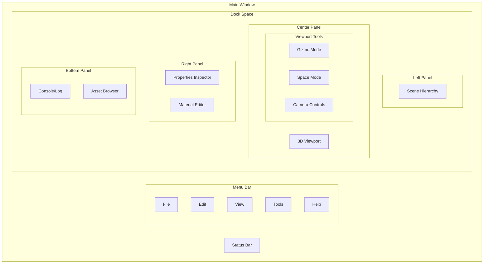
```mermaid
graph TB
    subgraph MainWindow["Main Window"]
        subgraph MenuBar["Menu Bar"]
            FileMenu["File"]
            EditMenu["Edit"]
            ViewMenu["View"]
            ToolsMenu["Tools"]
            HelpMenu["Help"]
        end

        subgraph DockSpace["Dock Space"]
            subgraph Left["Left Panel"]
                SceneHierarchy["Scene Hierarchy"]
            end

            subgraph Center["Center Panel"]
                Viewport["3D Viewport"]
                subgraph ViewportTools["Viewport Tools"]
                    GizmoSelector["Gizmo Mode"]
                    SpaceSelector["Space Mode"]
                    CameraControls["Camera Controls"]
                end
            end

            subgraph Right["Right Panel"]
                Properties["Properties Inspector"]
                Materials["Material Editor"]
            end

            subgraph Bottom["Bottom Panel"]
                Console["Console/Log"]
                Assets["Asset Browser"]
            end
        end

        StatusBar["Status Bar"]
    end
```

---

## Data Flow Diagrams

### Application Lifecycle

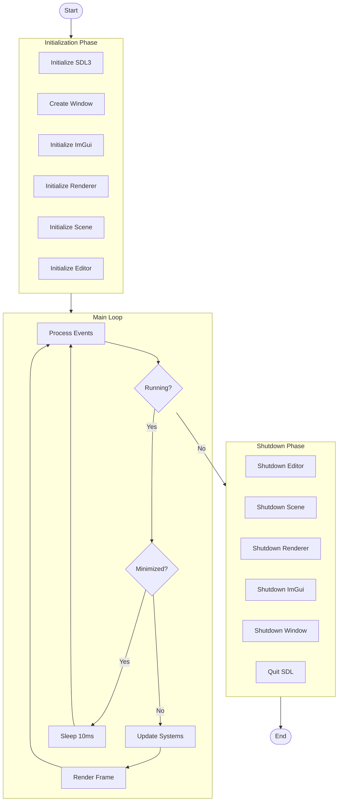
```mermaid
flowchart TB
    Start([Start]) --> Init

    subgraph Init["Initialization Phase"]
        InitSDL["Initialize SDL3"]
        CreateWindow["Create Window"]
        InitImGui["Initialize ImGui"]
        InitRenderer["Initialize Renderer"]
        InitScene["Initialize Scene"]
        InitEditor["Initialize Editor"]
    end

    Init --> MainLoop

    subgraph MainLoop["Main Loop"]
        ProcessEvents["Process Events"]
        CheckRunning{Running?}
        CheckMinimized{Minimized?}
        Update["Update Systems"]
        Render["Render Frame"]
        Sleep["Sleep 10ms"]
    end

    ProcessEvents --> CheckRunning
    CheckRunning -->|Yes| CheckMinimized
    CheckRunning -->|No| Shutdown
    CheckMinimized -->|Yes| Sleep
    CheckMinimized -->|No| Update
    Sleep --> ProcessEvents
    Update --> Render
    Render --> ProcessEvents

    subgraph Shutdown["Shutdown Phase"]
        ShutdownEditor["Shutdown Editor"]
        ShutdownScene["Shutdown Scene"]
        ShutdownRenderer["Shutdown Renderer"]
        ShutdownImGui["Shutdown ImGui"]
        ShutdownWindow["Shutdown Window"]
        ShutdownSDL["Quit SDL"]
    end

    Shutdown --> End([End])
```

### Frame Update Flow

```mermaid
flowchart LR
    subgraph EventPhase["Event Processing"]
        PollEvents["Poll SDL Events"]
        ProcessInput["Process Input"]
        ImGuiEvents["ImGui Events"]
    end

    subgraph UpdatePhase["Update Phase"]
        UpdateScene["Update Scene"]
        UpdateSpatial["Update Spatial Index"]
        UpdateAnimation["Update Animations"]
        UpdateEditor["Update Editor"]
    end

    subgraph CullPhase["Culling Phase"]
        FrustumCull["Frustum Culling"]
        OcclusionCull["Occlusion Culling"]
        LODSelect["LOD Selection"]
    end

    subgraph RenderPhase["Render Phase"]
        SortDraws["Sort Draw Calls"]
        BindPipeline["Bind Pipeline"]
        DrawGeometry["Draw Geometry"]
        RenderUI["Render UI"]
        Present["Present Frame"]
    end

    EventPhase --> UpdatePhase
    UpdatePhase --> CullPhase
    CullPhase --> RenderPhase
```

### Import/Export Data Flow

```mermaid
flowchart TB
    subgraph Import["Import Flow"]
        ImportFile["Import File"]
        DetectFormat["Detect Format"]
        
        subgraph Parsers["Format Parsers"]
            OSMParser["OSM Parser"]
            GLTFParser["glTF Parser"]
            FBXParser["FBX Parser"]
        end
        
        CreateEntities["Create Entities"]
        GenerateMeshes["Generate Meshes"]
        AssignMaterials["Assign Materials"]
    end

    subgraph Export["Export Flow"]
        SelectEntities["Select Entities"]
        CollectMeshes["Collect Meshes"]
        
        subgraph Exporters["Format Exporters"]
            GLTFExport["glTF Exporter"]
            FBXExport["FBX Exporter"]
            OBJExport["OBJ Exporter"]
        end
        
        OptimizeMeshes["Optimize Meshes"]
        EmbedTextures["Embed/Reference Textures"]
        WriteFile["Write File"]
    end

    ImportFile --> DetectFormat
    DetectFormat --> OSMParser
    DetectFormat --> GLTFParser
    DetectFormat --> FBXParser
    OSMParser --> CreateEntities
    GLTFParser --> CreateEntities
    FBXParser --> CreateEntities
    CreateEntities --> GenerateMeshes
    GenerateMeshes --> AssignMaterials

    SelectEntities --> CollectMeshes
    CollectMeshes --> OptimizeMeshes
    OptimizeMeshes --> GLTFExport
    OptimizeMeshes --> FBXExport
    OptimizeMeshes --> OBJExport
    GLTFExport --> EmbedTextures
    FBXExport --> EmbedTextures
    OBJExport --> EmbedTextures
    EmbedTextures --> WriteFile
```

---

## Sequence Diagrams

### Application Startup Sequence

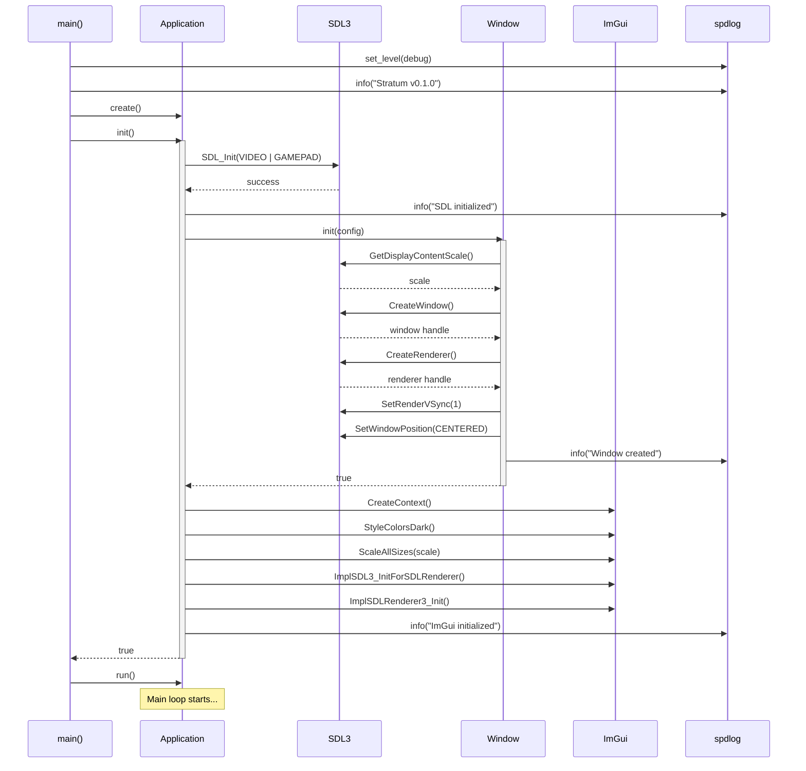
```mermaid
sequenceDiagram
    participant Main as main()
    participant App as Application
    participant SDL as SDL3
    participant Win as Window
    participant ImGui as ImGui
    participant Log as spdlog

    Main->>Log: set_level(debug)
    Main->>Log: info("Stratum v0.1.0")
    Main->>App: create()
    Main->>App: init()
    
    activate App
    App->>SDL: SDL_Init(VIDEO | GAMEPAD)
    SDL-->>App: success
    App->>Log: info("SDL initialized")
    
    App->>Win: init(config)
    activate Win
    Win->>SDL: GetDisplayContentScale()
    SDL-->>Win: scale
    Win->>SDL: CreateWindow()
    SDL-->>Win: window handle
    Win->>SDL: CreateRenderer()
    SDL-->>Win: renderer handle
    Win->>SDL: SetRenderVSync(1)
    Win->>SDL: SetWindowPosition(CENTERED)
    Win->>Log: info("Window created")
    Win-->>App: true
    deactivate Win
    
    App->>ImGui: CreateContext()
    App->>ImGui: StyleColorsDark()
    App->>ImGui: ScaleAllSizes(scale)
    App->>ImGui: ImplSDL3_InitForSDLRenderer()
    App->>ImGui: ImplSDLRenderer3_Init()
    App->>Log: info("ImGui initialized")
    App-->>Main: true
    deactivate App
    
    Main->>App: run()
    Note over App: Main loop starts...
```

### Frame Rendering Sequence

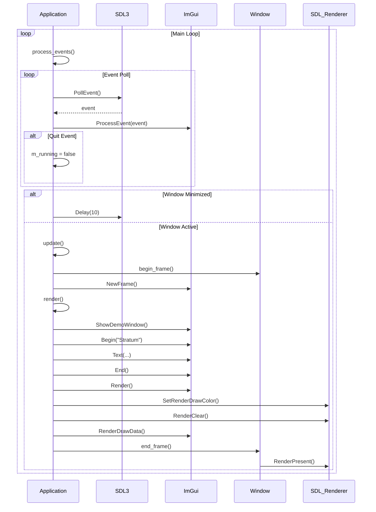
```mermaid
sequenceDiagram
    participant App as Application
    participant SDL as SDL3
    participant ImGui as ImGui
    participant Win as Window
    participant Renderer as SDL_Renderer

    loop Main Loop
        App->>App: process_events()
        
        loop Event Poll
            App->>SDL: PollEvent()
            SDL-->>App: event
            App->>ImGui: ProcessEvent(event)
            alt Quit Event
                App->>App: m_running = false
            end
        end
        
        alt Window Minimized
            App->>SDL: Delay(10)
        else Window Active
            App->>App: update()
            App->>Win: begin_frame()
            App->>ImGui: NewFrame()
            
            App->>App: render()
            App->>ImGui: ShowDemoWindow()
            App->>ImGui: Begin("Stratum")
            App->>ImGui: Text(...)
            App->>ImGui: End()
            App->>ImGui: Render()
            
            App->>Renderer: SetRenderDrawColor()
            App->>Renderer: RenderClear()
            App->>ImGui: RenderDrawData()
            App->>Win: end_frame()
            Win->>Renderer: RenderPresent()
        end
    end
```

### OSM Import Sequence

```mermaid
sequenceDiagram
    participant User
    participant Editor as Editor/OSMPanel
    participant Parser as OSM Parser
    participant Builder as MeshBuilder
    participant Scene as Scene
    participant Spatial as Spatial Index

    User->>Editor: Select OSM file
    Editor->>Parser: parse_file(path)
    
    activate Parser
    Parser->>Parser: Detect format (.osm/.pbf)
    Parser->>Parser: Parse nodes
    Parser->>Parser: Parse ways
    Parser->>Parser: Parse relations
    Parser-->>Editor: OSMData
    deactivate Parser
    
    Editor->>Builder: build_buildings(data)
    activate Builder
    
    loop For each building way
        Builder->>Builder: Extract polygon
        Builder->>Builder: Determine height
        Builder->>Builder: Extrude to 3D
        Builder->>Builder: Triangulate
        Builder->>Scene: create_entity()
        Scene-->>Builder: entity
        Builder->>Builder: Add components
        Builder->>Spatial: insert(entity, bounds)
    end
    
    Builder-->>Editor: building meshes
    deactivate Builder
    
    Editor->>Builder: build_roads(data)
    Editor->>Builder: build_terrain(data)
    
    Editor->>User: Import complete
```

---

## State Diagrams

### Application State Machine

```mermaid
stateDiagram-v2
    [*] --> Uninitialized
    
    Uninitialized --> Initializing: init()
    Initializing --> Running: success
    Initializing --> Error: failure
    
    Running --> Running: frame loop
    Running --> Paused: minimize
    Paused --> Running: restore
    Running --> ShuttingDown: quit
    
    ShuttingDown --> [*]
    Error --> [*]
    
    state Running {
        [*] --> ProcessingEvents
        ProcessingEvents --> Updating
        Updating --> Rendering
        Rendering --> ProcessingEvents
    }
```

### Editor Selection State

```mermaid
stateDiagram-v2
    [*] --> NoSelection
    
    NoSelection --> SingleSelection: click entity
    SingleSelection --> NoSelection: click empty
    SingleSelection --> SingleSelection: click different entity
    SingleSelection --> MultiSelection: Ctrl+click entity
    MultiSelection --> SingleSelection: click entity
    MultiSelection --> MultiSelection: Ctrl+click
    MultiSelection --> NoSelection: Escape
    
    state SingleSelection {
        [*] --> Idle
        Idle --> Translating: drag gizmo (translate mode)
        Idle --> Rotating: drag gizmo (rotate mode)
        Idle --> Scaling: drag gizmo (scale mode)
        Translating --> Idle: release
        Rotating --> Idle: release
        Scaling --> Idle: release
    }
```

### Tile Loading State

```mermaid
stateDiagram-v2
    [*] --> Unloaded
    
    Unloaded --> Loading: camera approaches
    Loading --> Loaded: load complete
    Loading --> Error: load failed
    
    Loaded --> Active: enter view frustum
    Active --> Loaded: exit view frustum
    Loaded --> Unloading: camera far away
    
    Unloading --> Unloaded: unload complete
    
    Error --> Unloaded: retry
    
    state Active {
        [*] --> FullDetail
        FullDetail --> LOD1: distance > threshold1
        LOD1 --> LOD2: distance > threshold2
        LOD2 --> LOD1: distance < threshold2
        LOD1 --> FullDetail: distance < threshold1
    }
```

---

## Deployment Diagram

```mermaid
graph TB
    subgraph UserMachine["User's Machine"]
        subgraph Application["Stratum Application"]
            Executable["stratum executable"]
            
            subgraph Libraries["Linked Libraries"]
                SDL3Lib["SDL3.dll/so"]
                RuntimeLibs["C++ Runtime"]
            end
            
            subgraph Assets["Application Assets"]
                Shaders["Shaders"]
                DefaultMats["Default Materials"]
                UIAssets["UI Assets"]
            end
        end
        
        subgraph UserData["User Data"]
            Projects["Projects"]
            Cache["Cache"]
            Settings["Settings"]
        end
        
        subgraph System["System"]
            GPU["GPU (Vulkan/Metal/D3D12)"]
            FileSystem["File System"]
        end
    end

    Executable --> SDL3Lib
    Executable --> RuntimeLibs
    Executable --> Assets
    Executable --> GPU
    Application --> UserData
    Application --> FileSystem
```

---

## Technology Stack Summary

```mermaid
mindmap
  root((Stratum))
    Core
      SDL3
        Window Management
        Input Handling
        GPU Abstraction
      spdlog
        Logging
    UI
      Dear ImGui
        Panels
        Dialogs
      ImGuizmo
        3D Gizmos
      imnodes
        Node Editor
    Rendering
      SDL_GPU
        Cross-platform
        Modern API
      meshoptimizer
        LOD Generation
      Draco
        Mesh Compression
    Scene
      EnTT
        ECS Framework
      BVH
        Spatial Queries
      GLM
        Math Library
    OSM
      libosmium
        File Parsing
      Clipper2
        Polygon Operations
      earcut
        Triangulation
    Materials
      MaterialX
        Material Definitions
      KTX
        Texture Format
    Export
      Assimp
        glTF
        FBX
        OBJ
    Scripting
      pybind11
        Python Bindings
    Profiling
      Tracy
        Performance Analysis
```

---

## Notes

- Classes marked `<<planned>>` are not yet implemented but are part of the architectural design.
- The architecture follows a modular design where each module has minimal dependencies on others.
- EnTT provides the Entity Component System (ECS) foundation for the scene graph.
- SDL3's new GPU API will be used for cross-platform rendering (Vulkan, Metal, D3D12).
- MaterialX ensures materials are portable across different renderers and applications.
