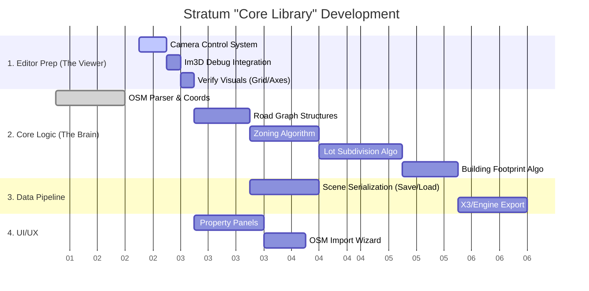

# Stratum Project Roadmap

## Strategy: "Library First, Visual Debugging"

This roadmap reflects the architectural split between **Stratum Core** (the reusable logic library) and **Stratum Editor** (the lightweight visualization tool). The goal is to build a powerful city generation library that can be imported into game engines (like X3), while using the Editor for rapid iteration and debugging.

## Feature Priority Matrix

| ID | Feature | Priority | Module | Description |
| :--- | :--- | :--- | :--- | :--- |
| **P0-1** | **3D Camera & Control** | **P0** | **Editor** | Free-flight camera to view the generated data. Critical for debugging. |
| **P0-2** | **Im3D Integration** | **P0** | **Editor** | Immediate-mode rendering for lines/points. The primary visualization method. |
| **P0-3** | **OSM Logic & Data** | **P0** | **Core** | Parsing XML, storing Node/Way data, handling coordinates. |
| **P1-1** | **Road Network Gen** | **P1** | **Core** | Algorithms to convert OSM ways -> Road Segments (width, lanes). |
| **P1-2** | **ProcGen: Zoning** | **P1** | **Core** | Logic to assign types (Residential, Commercial) to empty areas. |
| **P1-3** | **ProcGen: Subdivision**| **P1** | **Core** | Splitting large blocks into individual lots/parcels. |
| **P2-1** | **Building Extrusion** | **P2** | **Core** | Generating 3D volumes from 2D footprints. |
| **P2-2** | **Export Format** | **P2** | **Core** | Converting internal data to a format X3/Game Engines can read (JSON/Binary). |
| **P3** | **Fancy Rendering** | **P3** | **Editor** | Shadows, lighting, textures. (Low priority, relying on debugging views). |

## Gantt Chart (Parallel Tracks)

## Architectural Overview

*   **Repository Strategy**: Monorepo.
*   **Editor Role**: A thin wrapper around `libStratum`. It exists solely to visualize the mathematical output of the Core library using fast, simple wireframe rendering.
*   **Core Role**: Pure C++20. No dependency on Graphics APIs. Takes input (settings/files) -> Returns Data (Vectors/Graphs).

### Integration Workflow
1.  **Develop** algorithm in `src/procgen/` or `src/osm/`.
2.  **Expose** debug data via a simple `DrawDebug()` function.
3.  **Run** Editor, hit "Generate", see result instantly via Im3D.
4.  **Ship** only the `src/` code (excluding Editor) to the Game Engine.
